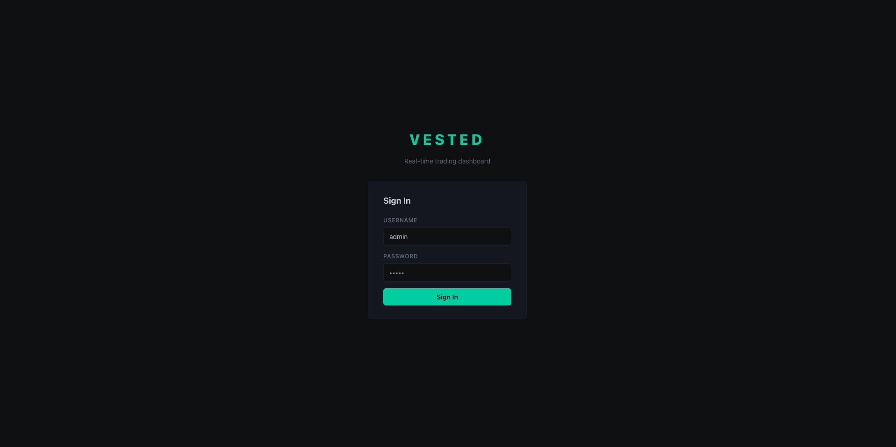
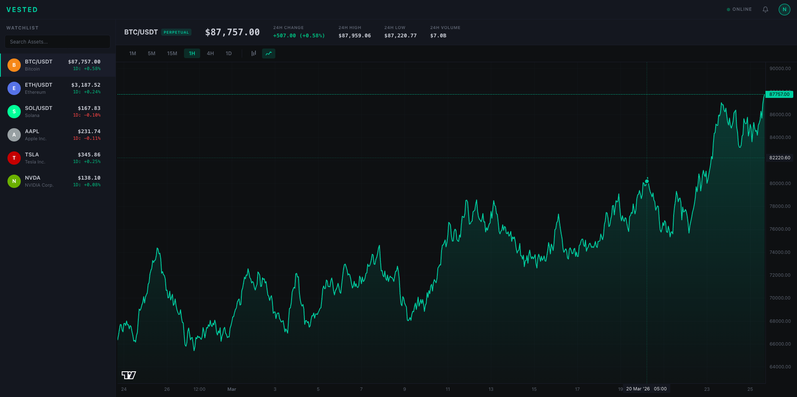
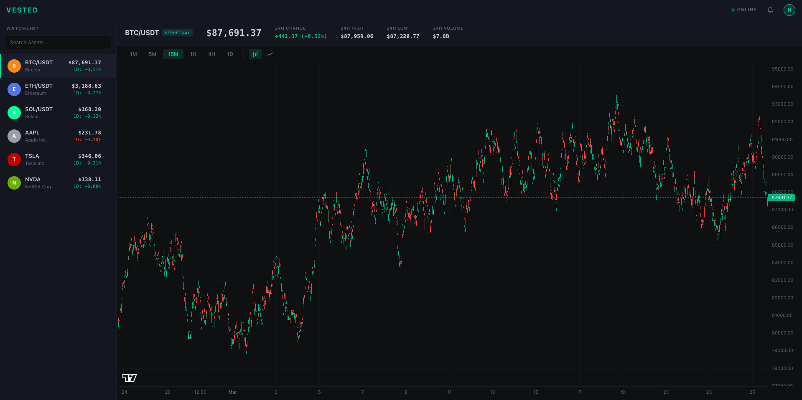
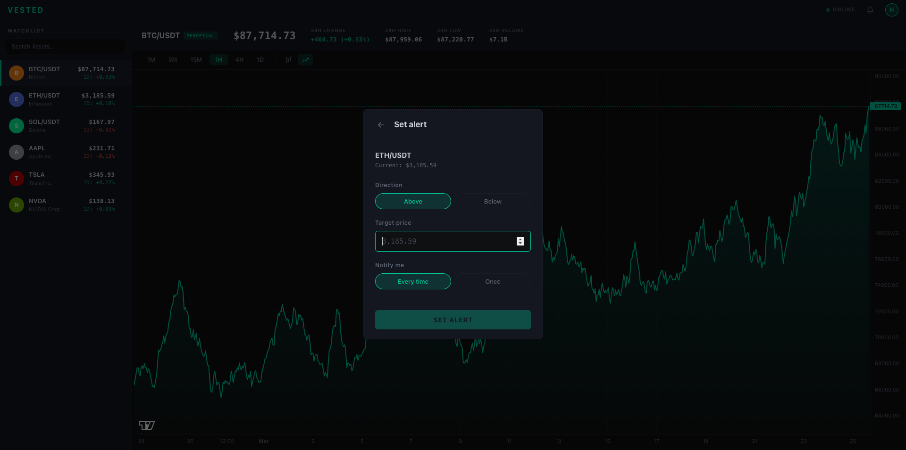
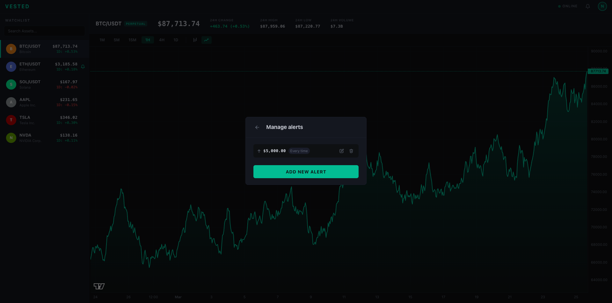
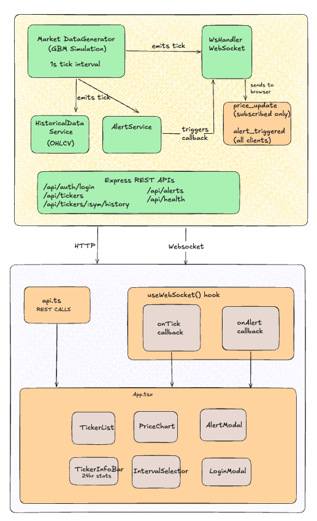

# Vested: Real-time trading dashboard

Full-stack trading dashboard with live price simulation, interactive charts, and price alerts. React + TypeScript on the frontend, Express + WebSocket on the backend.

**[Figma Design](https://www.figma.com/design/LtTF1hBR4nTshNHI2wLYhx/Real-Time-Dashboard?node-id=1-22&t=TCDsGy4yQNDJXh5Q-0)**

## Overview

Vested is a simulated trading dashboard that streams live prices for six tickers (BTC/USDT, ETH/USDT, SOL/USDT, AAPL, TSLA, NVDA) over WebSocket at 1-second intervals. You get a searchable watchlist, candlestick and line charts across six timeframes, price alerts with real-time notifications, and mock JWT auth.

## Features

- Live WebSocket price streaming (1s tick interval)
- Price simulation using geometric Brownian motion
- 30 days of generated OHLCV history across 6 intervals (1m, 5m, 15m, 1h, 4h, 1d)
- Candlestick and area charts via TradingView Lightweight Charts
- Searchable watchlist with real-time price and 24h change
- Price alerts — above/below threshold, "once" or "every time" trigger modes
- Bell icon notification center for triggered alerts
- Create, edit, and delete alerts per ticker
- Mock JWT login/logout with protected routes
- Auto-reconnecting WebSocket with exponential backoff (1s -> 30s cap)
- LRU cache on historical data responses
- Dark theme, responsive layout

## Screenshots

### Sign In



### Line Chart View



### Candlestick Chart View



### Set Alert



### Manage Alerts



## Architecture



[View on Excalidraw](https://excalidraw.com/#json=QTD2E6-u15FfXszScpg8t,sy_rx2jrfdIF_RfcEOxMTw) (if above picture isn't clear)

**Backend (Express + WebSocket, port 4000)**

- `MarketDataGenerator` — ticks every second using GBM, emits price events
- `HistoricalDataService` — generates and LRU-caches 30 days of OHLCV candles
- `AlertService` — checks threshold crossings on each tick, fires callbacks
- `WsHandler` — manages subscriptions, broadcasts `price_update` and `alert_triggered`
- REST API — auth, ticker snapshots, history, alert CRUD

**Frontend (React + Vite, port 3000)**

- `useWebSocket` — connection management, `onTick`/`onAlert` callbacks
- `api.ts` — REST client
- `App.tsx` — top-level state and layout
- Components: `TickerList`, `PriceChart`, `AlertModal`, `TickerInfoBar`, `IntervalSelector`, `LoginModal`, `Header`

## Tech Stack

| Layer       | Technology                                                   |
| ----------- | ------------------------------------------------------------ |
| Frontend    | React 19, TypeScript, Vite 6, TradingView Lightweight Charts |
| Backend     | Node.js, Express, TypeScript, ws                             |
| Auth        | JWT (mock)                                                   |
| Caching     | LRU Cache                                                    |
| Testing     | Jest, ts-jest, Supertest                                     |
| Containers  | Docker, Docker Compose, Kubernetes, Nginx                    |
| Dev Tooling | tsx (watch mode), ESLint, Prettier                           |

## Setup & Running

### Prerequisites

- Node.js 18+ and npm

### Installation

```bash
git clone <repo-url>
cd real-time-trading-dashboard

cd backend && npm install
cd ../frontend && npm install
```

### Running the Backend

```bash
cd backend
npm run dev
```

Starts on [http://localhost:4000](http://localhost:4000). WebSocket at `ws://localhost:4000/ws`.

### Running the Frontend

```bash
cd frontend
npm run dev
```

Opens on [http://localhost:3000](http://localhost:3000).

### Login Credentials

| Username | Password |
| -------- | -------- |
| `admin`  | `admin`  |

### Environment Variables

All optional — defaults work out of the box.

| Variable       | Default                         | Description          |
| -------------- | ------------------------------- | -------------------- |
| `PORT`         | `4000`                          | Backend port         |
| `JWT_SECRET`   | `dev-secret-do-not-use-in-prod` | JWT signing secret   |
| `VITE_API_URL` | `http://localhost:4000`         | Frontend API base    |
| `VITE_WS_URL`  | `ws://localhost:4000/ws`        | Frontend WS endpoint |

## Docker

```bash
docker compose up --build
```

App runs at [http://localhost:3000](http://localhost:3000). Backend API and WebSocket are reverse-proxied through Nginx, so everything goes through port 3000.

```bash
docker compose up --build -d   # detached
docker compose down             # stop & remove
```

## Kubernetes

Manifests are in `k8s/`. Requires a running cluster (e.g. minikube, Docker Desktop, or a cloud provider).

```bash
# Build images (if using minikube, point to its Docker daemon first)
docker build -t trading-dashboard-backend:latest ./backend
docker build -t trading-dashboard-frontend:latest --build-arg VITE_API_URL="" --build-arg VITE_WS_URL="" ./frontend

# Apply manifests
kubectl apply -f k8s/namespace.yaml
kubectl apply -f k8s/backend.yaml
kubectl apply -f k8s/frontend.yaml

# Check status
kubectl get pods -n trading-dashboard
```

The frontend Service is type `LoadBalancer` (port 80 -> 3000). On minikube:

```bash
minikube service frontend -n trading-dashboard
```

## Running Tests

```bash
cd backend
npm test
```

Watch mode:

```bash
cd backend
npm run test:watch
```

## Assumptions & Trade-offs

**Assumptions**

- All prices are simulated (GBM) — no real exchange connections. This is by design so the project is fully self-contained with zero external dependencies.
- Single-user system. Alerts aren't partitioned by user — the mock auth is there to show the JWT pattern, not to be production-grade.
- Desktop-first. The layout is responsive but hasn't been fine-tuned for mobile.
- Everything is in-memory. Restart the server and all data (prices, alerts, candles) resets.

**Trade-offs**

- **In-memory over a database**: No Postgres/Redis setup needed, but nothing persists across restarts. Keeps the project zero-config.
- **Simulated prices over a real API**: Full control over tick rate, no API keys or rate limits to deal with. Prices aren't real, but that's fine for a demo.
- **Mock auth over full auth**: JWT issuance and middleware are real, but there's no registration, refresh tokens, or proper password hashing. Didn't want auth complexity to overshadow the actual dashboard.
- **No automation tests**: Would add React Testing Library / Cypress if this were going to production.
- **Alerts broadcast to all clients**: `alert_triggered` goes to every connected client, not just the owner. Fine for single-user; would need scoping in a multi-user setup.
